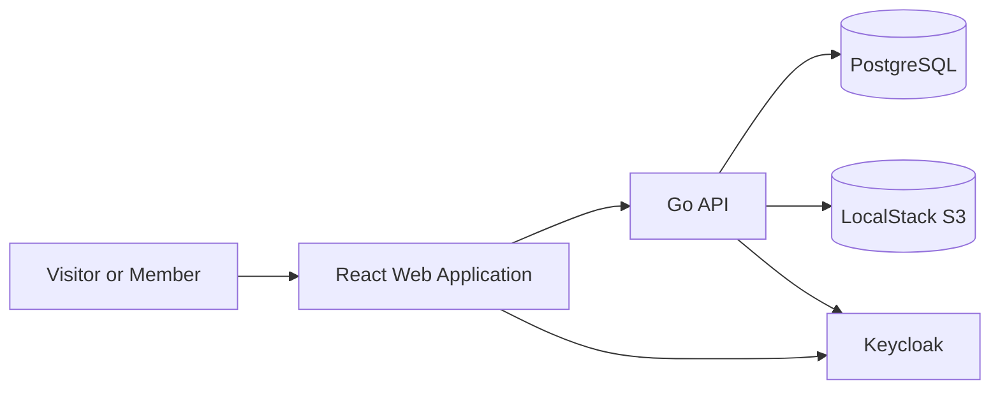

---

name: documentation
description: Defines documentation standards for the reptile knowledge platform. Use this skill for README files, ADRs, C4 diagrams, OpenAPI documentation, runbooks, development guides, product documentation, architecture records, change documentation, and keeping technical contracts synchronized.
when_to_use: Use whenever a task creates, changes, reviews, validates, or reorganizes documentation, public contracts, architectural decisions, development instructions, operational procedures, API specifications, diagrams, or project onboarding material.
argument-hint: "[documentation-task-or-change]"
disable-model-invocation: false
user-invocable: true
model: inherit
effort: high
paths:

* "README.md"
* "CLAUDE.md"
* ".claude/**"
* "docs/**"
* "apps/api/openapi/**"
* "**/*.md"
* "**/*.mdx"
* "**/*.yaml"
* "**/*.yml"
* "Makefile"
* ".env.example"
* ".github/workflows/**"

---

# Documentation

## Objective

Define and enforce documentation standards for the reptile knowledge platform.

Use this skill to guide:

* project README;
* onboarding documentation;
* development setup;
* architecture documentation;
* Architecture Decision Records;
* C4 diagrams;
* domain documentation;
* API documentation;
* OpenAPI;
* operational runbooks;
* infrastructure documentation;
* security documentation;
* testing documentation;
* environment-variable documentation;
* change documentation;
* synchronization between code and contracts.

The current task is:

```text
$ARGUMENTS
```

If no arguments were provided, infer the task from the current conversation.

---

## Mandatory Context

Before creating or changing documentation:

1. Read `${CLAUDE_PROJECT_DIR}/CLAUDE.md`.
2. Inspect the implementation related to the documentation.
3. Inspect existing documentation structure.
4. Identify the current project phase.
5. Identify the target audience.
6. Identify whether the document is normative, explanatory, operational, or historical.
7. Identify affected contracts.
8. Identify whether existing documentation must be updated instead of creating a new file.
9. Verify every command, path, port, environment variable, and example against the repository.
10. Avoid documenting features that do not exist.
11. Preserve established terminology.
12. Link to related documents rather than duplicating them.

Do not write documentation based only on assumptions.

Do not document future behavior as if it were already implemented.

---

## Core Principles

Documentation must be:

* accurate;
* current;
* concise;
* discoverable;
* structured;
* audience-aware;
* actionable;
* versioned with the code;
* explicit about limitations;
* consistent with implementation;
* easy to maintain;
* free from duplicated sources of truth.

Documentation is part of the product.

A feature is not complete when users, developers, or operators cannot understand how to use or maintain it.

Do not create documentation that merely repeats code structure without explaining purpose.

---

## Documentation Types

The project may contain these documentation categories:

```text
project
product
architecture
development
api
operations
security
testing
decisions
```

Recommended structure:

```text
docs/
├── product/
├── architecture/
├── development/
├── api/
├── runbooks/
├── security/
├── testing/
├── design/
└── adr/
```

Create only directories that contain real documentation.

Do not create empty directory trees for appearance.

---

## Documentation Ownership

Each document must have a clear responsibility.

### README

Entry point for the repository.

### Product Documentation

Explains the problem, domain, terminology, scope, and roadmap.

### Architecture Documentation

Explains system structure, boundaries, deployment, data flow, and quality attributes.

### ADR

Records a specific architectural decision and its consequences.

### API Documentation

Defines public and administrative API contracts.

### Development Documentation

Explains setup, workflows, commands, conventions, and troubleshooting.

### Runbooks

Explain how to diagnose and recover from operational failures.

### Security Documentation

Explains trust boundaries, access control, threat model, and security procedures.

### Testing Documentation

Explains test strategy, test environments, and quality gates.

Do not mix all concerns into one oversized README.

---

## Root README

The root `README.md` should be the main project entry point.

It should answer:

1. What is the project?
2. Why does it exist?
3. What is currently implemented?
4. What is the technology stack?
5. How do I run it locally?
6. Which services and ports are used?
7. Which commands are available?
8. How do I run tests?
9. Where is deeper documentation?
10. What are the current limitations?

Recommended outline:

```text
Project title
Project status
Overview
Current scope
Architecture summary
Technology stack
Prerequisites
Quick start
Local services
Available commands
Testing and validation
Repository structure
Documentation map
Roadmap
Contributing
License
```

Do not include sections that have no meaningful content.

---

## README Accuracy

Every command in the README must exist.

Every path must exist.

Every service URL must match configuration.

Every environment variable must match `.env.example`.

Every project status statement must reflect reality.

Do not write:

```text
Run make deploy
```

if no such target exists.

Do not claim AWS deployment support before it exists.

---

## Quick Start

The quick-start flow should remain short.

Target:

```bash
cp .env.example .env
make bootstrap
make up
make migrate
make seed
```

Then list expected URLs.

Do not require users to read several pages before starting.

Move advanced setup and troubleshooting to dedicated documents.

---

## Project Status

Clearly state the current phase.

Example:

```text
Current phase: Phase 0 — Foundation
```

List implemented capabilities and planned capabilities separately.

Do not blur roadmap and current functionality.

Use labels such as:

```text
Implemented
In progress
Planned
Out of scope
```

---

## Documentation Map

The README should link to deeper documents.

Example:

```text
Architecture overview
Local development guide
Testing strategy
Domain glossary
API specification
Security baseline
Operational runbooks
Architecture decisions
```

Do not duplicate the entire content of those documents inside the README.

---

## Product Documentation

Recommended files:

```text
docs/product/vision.md
docs/product/roadmap.md
docs/product/domain-glossary.md
docs/product/taxonomy.md
docs/product/species-content-model.md
docs/product/article-content-model.md
docs/product/editorial-guidelines.md
docs/product/reference-policy.md
```

Create them incrementally.

Do not create speculative documents with no approved content.

---

## Product Vision

The vision document should explain:

* target audience;
* problem;
* product value;
* principles;
* initial scope;
* non-goals;
* long-term direction.

Avoid technical implementation detail.

Do not turn the vision document into a backlog.

---

## Roadmap

The roadmap should reflect official phases:

```text
Phase 0 — Foundation
Phase 1 — Public Catalog
Phase 2 — Users and Authentication
Phase 3 — Administration
Phase 4 — Advanced Editorial Experience
Phase 5 — Gamification
Phase 6 — AWS Deployment
```

For each phase, include:

* objective;
* scope;
* acceptance criteria;
* exclusions;
* dependencies.

Do not include delivery dates unless they are real commitments.

Do not mark a phase complete without evidence.

---

## Domain Glossary

The domain glossary should define canonical terms.

Examples:

```text
Species
Taxon
Taxonomic rank
Scientific name
Common name
Editorial group
Article
Content block
Reference
Conservation assessment
Media asset
Activity event
```

Each term should have one preferred definition.

Do not use different names for the same concept across documents.

Do not use ambiguous terms such as `type` without qualification.

---

## Scientific Documentation

Documentation about reptiles must distinguish:

* scientific taxonomy;
* editorial grouping;
* species information;
* conservation assessment;
* geographic distribution;
* ecological role.

Do not present editorial categories as taxonomic truth.

Do not invent scientific examples to fill documentation.

Use clearly marked illustrative data when needed.

---

## Editorial Guidelines

Editorial guidelines should explain:

* tone;
* scientific accuracy;
* uncertainty;
* source attribution;
* risk language;
* conservation context;
* common and scientific names;
* image credit;
* prohibited content;
* publication readiness.

Do not mix technical editor implementation details with editorial policy unless the connection is necessary.

---

## Reference Policy

The reference policy should define:

* accepted source types;
* source priority;
* citation requirements;
* access dates;
* DOI handling;
* conservation assessments;
* image licensing;
* unsupported source types;
* outdated-source review.

Do not treat unsourced blogs or AI-generated text as authoritative references.

---

## Architecture Documentation

Recommended files:

```text
docs/architecture/context.md
docs/architecture/containers.md
docs/architecture/components.md
docs/architecture/deployment.md
docs/architecture/data.md
docs/architecture/security.md
docs/architecture/observability.md
```

Create only those required by the current phase.

Do not document components that do not exist.

---

## Architecture Overview

Architecture documentation should explain:

* system purpose;
* users;
* external systems;
* major containers;
* module boundaries;
* data stores;
* authentication;
* media storage;
* local environment;
* future AWS direction.

Avoid overly detailed class diagrams.

Focus on decisions and boundaries.

---

## C4 Model

Use C4-style diagrams where useful.

Recommended levels:

```text
System Context
Container
Component
Deployment
```

Phase 0 should at least include:

* context;
* containers;
* local deployment.

Do not create code-level C4 diagrams for every package.

---

## Mermaid

Use Mermaid for version-controlled diagrams when it is sufficiently expressive.

Example:



Diagram labels must match actual names.

Do not create diagrams that contradict the written text.

---

## Diagram Rules

Every diagram should include:

* title or surrounding explanation;
* clear boundaries;
* named relationships;
* relevant protocols when useful;
* local or AWS context;
* current or planned status.

Distinguish planned resources visually or textually.

Do not present future AWS architecture as currently deployed.

---

## Deployment Documentation

The deployment document should distinguish:

### Current local deployment

* Docker Compose;
* PostgreSQL;
* Redis;
* LocalStack;
* Keycloak;
* Mailpit;
* API;
* frontend.

### Future AWS deployment

* CloudFront;
* S3;
* ECS Fargate;
* RDS;
* ElastiCache;
* Cognito;
* SES;
* SQS;
* CloudWatch;
* WAF;
* Route 53;
* ACM.

Do not merge both into one diagram without a clear distinction.

---

## Architecture Decision Records

Store ADRs under:

```text
docs/adr/
```

Recommended naming:

```text
0001-use-modular-monolith.md
0002-use-postgresql.md
0003-use-react-and-vite.md
0004-use-keycloak-locally-and-cognito-on-aws.md
```

Use zero-padded numbers.

Do not renumber existing ADRs.

---

## ADR Template

Use:

```markdown
# ADR-XXXX: Decision Title

## Status

Proposed | Accepted | Superseded | Deprecated | Rejected

## Context

What problem or constraint required a decision?

## Decision

What was decided?

## Consequences

What positive and negative consequences follow?

## Alternatives Considered

Which alternatives were evaluated?

## Related Decisions

Links to related ADRs or documents.
```

Optional sections:

```text
Date
Decision owners
Security considerations
Migration strategy
```

Do not write ADRs as implementation tutorials.

---

## ADR Status

Use statuses consistently.

### Proposed

Not yet accepted.

### Accepted

Current decision.

### Superseded

Replaced by another ADR.

### Deprecated

Still present but discouraged or being removed.

### Rejected

Considered and not adopted.

When superseding an ADR:

* update old ADR status;
* link to new ADR;
* preserve historical content.

Do not delete historical ADRs.

---

## When to Create an ADR

Create an ADR for decisions such as:

* modular monolith;
* PostgreSQL;
* sqlc;
* React and Vite;
* structured article content;
* Keycloak locally and Cognito later;
* S3 media storage;
* PostgreSQL Full Text Search;
* Terraform environment strategy;
* authentication role ownership;
* static frontend hosting.

Do not create ADRs for:

* small variable names;
* ordinary bug fixes;
* routine dependency patches;
* minor visual changes;
* obvious implementation details.

---

## ADR Accuracy

An ADR must describe the actual decision.

Do not mark a speculative option as accepted.

Do not omit important negative consequences.

Do not rewrite historical context after the decision changes.

Create a new ADR when the decision materially changes.

---

## OpenAPI

OpenAPI is a technical contract.

It must remain synchronized with:

* routes;
* request models;
* response models;
* errors;
* authentication;
* pagination;
* filters;
* examples.

Do not document an endpoint that the backend does not implement unless clearly marked as proposed in a separate design document.

---

## OpenAPI Structure

The specification should define:

* title;
* version;
* servers;
* tags;
* paths;
* operation IDs;
* parameters;
* request bodies;
* responses;
* schemas;
* security schemes;
* reusable error responses.

Example operation IDs:

```text
listSpecies
getSpeciesBySlug
listArticles
getArticleBySlug
publishArticle
```

Do not use unstable or duplicated operation IDs.

---

## API Documentation Rules

For every endpoint, document:

* purpose;
* authentication;
* authorization;
* path parameters;
* query parameters;
* request body;
* successful responses;
* error responses;
* pagination;
* visibility rules;
* examples when useful.

Do not expose internal database fields merely because they exist.

---

## API Error Documentation

Document the standard error schema.

Example:

```json
{
  "type": "validation_error",
  "title": "Invalid request",
  "status": 422,
  "detail": "One or more fields are invalid.",
  "correlationId": "uuid",
  "errors": [
    {
      "field": "scientificName",
      "message": "Scientific name is required."
    }
  ]
}
```

Document common error types.

Do not let each endpoint invent a different error structure.

---

## API Examples

Examples must be:

* valid;
* minimal;
* realistic;
* consistent with schemas;
* free from personal data;
* free from secrets;
* clearly illustrative.

Do not use real tokens.

Do not use production URLs.

Do not include unsupported fields.

---

## Public vs Administrative API

Document public and administrative endpoints separately.

Public documentation should emphasize:

* published content;
* read-only behavior;
* search and filters.

Administrative documentation should emphasize:

* authentication;
* permissions;
* draft content;
* workflow;
* validation;
* audit behavior.

Do not imply administrative endpoints are publicly accessible.

---

## Development Documentation

Recommended files:

```text
docs/development/local-setup.md
docs/development/backend.md
docs/development/frontend.md
docs/development/database.md
docs/development/terraform.md
docs/development/testing.md
docs/development/conventions.md
```

Create only as needed.

Do not split a small amount of information into many tiny documents.

---

## Local Setup Guide

The local setup guide should contain:

* prerequisites;
* initial commands;
* environment variables;
* service URLs;
* local credentials;
* migrations;
* seed;
* validation;
* reset;
* common problems.

It should clearly distinguish:

* browser URLs;
* container URLs;
* host ports.

Do not include real credentials.

---

## Command Documentation

Commands should match the Makefile.

For each command, explain:

* purpose;
* whether it mutates data;
* required services;
* important options;
* destructive behavior.

Example:

```text
make up
Starts the local Docker Compose services and preserves existing volumes.
```

```text
make reset
Removes project-local containers and volumes. Local data will be lost.
```

Do not document placeholder targets.

---

## Environment Variables

`.env.example` and documentation must remain synchronized.

Document variables by category:

```text
application
backend
frontend
database
Redis
LocalStack
Keycloak
Mailpit
Terraform
```

For each variable, explain:

* purpose;
* required or optional;
* default;
* whether it is public;
* whether it is sensitive;
* local example.

Do not document secrets with real values.

---

## Frontend Variables

Clearly state:

```text
Variables prefixed with VITE_ are bundled into the frontend and are public.
```

Do not place secrets in `VITE_` variables.

Documentation must reinforce this rule.

---

## Database Documentation

Document:

* migration tool;
* migration naming;
* migration commands;
* sqlc generation;
* seed behavior;
* test database;
* destructive reset;
* schema ownership;
* JSONB usage;
* important constraints.

Do not duplicate the full schema in prose.

Use diagrams or model summaries where helpful.

---

## Terraform Documentation

Document:

* environment directories;
* modules;
* provider versions;
* state strategy;
* LocalStack endpoints;
* initialization;
* validation;
* planning;
* local apply;
* real AWS safety;
* prohibited operations;
* known LocalStack gaps.

Do not provide a generic real AWS apply command without safety context.

---

## Testing Documentation

Document:

* test pyramid;
* unit commands;
* integration requirements;
* E2E requirements;
* CI gates;
* coverage philosophy;
* fixtures;
* test users;
* LocalStack or Keycloak dependencies;
* failure artifacts.

Do not claim a test level exists before tests are implemented.

---

## Security Documentation

Recommended files:

```text
docs/security/security-baseline.md
docs/security/threat-model.md
docs/security/access-control.md
docs/security/upload-security.md
```

Document actual controls and residual risks.

Do not publish operational secrets or sensitive internal configuration.

---

## Access-Control Documentation

Document:

* roles;
* permissions;
* role-to-permission mapping;
* object-level authorization;
* default deny;
* public endpoints;
* authenticated endpoints;
* administrative endpoints.

Use a permission matrix.

Do not rely on code as the only access-control reference.

---

## Runbooks

Store runbooks under:

```text
docs/runbooks/
```

Create runbooks for situations that require diagnosis or recovery.

Examples:

```text
local-development.md
database-unavailable.md
api-unhealthy.md
keycloak-unavailable.md
media-upload-failure.md
secret-exposure.md
deployment-rollback.md
```

Do not create runbooks for ordinary feature usage.

---

## Runbook Template

Use:

```markdown
# Runbook: Incident or Failure Name

## Purpose

## Symptoms

## Impact

## Detection

## Immediate Checks

## Diagnostic Commands

## Likely Causes

## Mitigation

## Recovery

## Verification

## Escalation

## Follow-Up
```

Include destructive warnings where needed.

Do not provide commands that can affect production without environment checks.

---

## Operational Commands

Commands must be safe and explicit.

Prefer:

```bash
docker compose logs api
curl --fail http://localhost:8080/ready
```

Avoid generic commands that may expose secrets.

When a command displays environment variables, warn about sensitive output.

---

## Troubleshooting Documentation

Troubleshooting should be problem-oriented.

Good headings:

```text
Backend cannot connect to PostgreSQL
Keycloak realm was not imported
Frontend cannot reach the API
LocalStack bucket does not exist
Port 8080 is already in use
```

Avoid generic sections such as:

```text
Other errors
```

Provide:

* symptom;
* likely cause;
* diagnostic command;
* solution;
* reset option when safe.

---

## Code Examples

Code examples must:

* compile or be clearly pseudocode;
* match project conventions;
* use current package names;
* avoid unsafe shortcuts;
* include error handling when relevant;
* avoid real secrets;
* remain small.

Mark pseudocode clearly.

Do not include copied examples that conflict with the actual architecture.

---

## Shell Examples

Shell examples should:

* use current commands;
* quote variables;
* avoid unsafe expansion;
* identify the working directory;
* include warnings for destructive commands;
* avoid real credentials.

Do not use deprecated `docker-compose` when the project uses `docker compose`.

---

## Configuration Examples

Configuration snippets should be minimal.

Use placeholders:

```text
your-local-value
example-only
replace-me
```

For local deterministic values, label them as local-only.

Do not encourage copying local credentials to AWS.

---

## Writing Style

Use clear technical English.

Prefer:

* direct sentences;
* active voice;
* concrete nouns;
* explicit verbs;
* short paragraphs;
* descriptive headings.

Avoid:

* marketing language;
* vague adjectives;
* unnecessary jargon;
* repeated explanations;
* unexplained abbreviations;
* excessive rhetorical language.

Use terminology consistently.

---

## Terminology

Canonical terms include:

```text
backend
frontend
API
species
taxon
taxonomy
editorial group
article
content block
media asset
reference
member
editor
administrator
LocalStack
Keycloak
Cognito
```

Use `species` as singular and plural.

Do not use `specie` as the singular English noun.

Do not alternate between `admin`, `administrator`, and `manager` without defining the distinction.

---

## Audience

Identify the primary audience.

Possible audiences:

* new developer;
* backend developer;
* frontend developer;
* platform engineer;
* editor;
* administrator;
* operator;
* security reviewer;
* API consumer.

Write for one primary audience.

Link to supporting material for other audiences.

Do not mix beginner onboarding and deep architecture discussion without structure.

---

## Normative Language

Use normative terms deliberately.

```text
must
must not
should
should not
may
```

### Must

Required behavior.

### Should

Recommended behavior with possible exceptions.

### May

Optional behavior.

Do not use `must` for preferences.

Do not use vague phrases such as:

```text
ideally
probably
usually
as needed
```

without context.

---

## Current vs Planned Behavior

Label planned content explicitly.

Use:

```text
Current
Planned
Future
Not implemented
```

Do not describe planned Cognito, ECS, or CloudFront resources as existing.

Do not show future commands as executable current workflows.

---

## Document Status

For design proposals, include a status.

Example:

```text
Status: Proposed
```

For current operational documentation, status may be unnecessary.

Do not leave obsolete proposed documents appearing authoritative.

Archive or update them.

---

## Dates

Use ISO dates when dates are needed:

```text
2026-07-12
```

Do not add dates that will require constant manual updates unless they serve a purpose.

For ADRs, the decision date may be useful.

---

## Version References

Pin version references only when they matter.

Examples:

* minimum Go version;
* Node version;
* Terraform range;
* PostgreSQL major version;
* Keycloak image version.

Do not duplicate version information across many documents.

Prefer one source of truth and link to it.

---

## Links

Use relative links for repository documents.

Example:

```markdown
[Local setup](docs/development/local-setup.md)
```

Verify links.

Do not link to files that do not exist.

Do not use raw external URLs repeatedly when a named link is clearer.

---

## External Documentation

Link to official documentation when external details are better maintained there.

Examples:

* Go;
* React;
* Terraform;
* AWS;
* Keycloak;
* LocalStack;
* PostgreSQL.

Do not copy large sections of third-party documentation.

Document project-specific decisions and usage.

---

## Duplicate Documentation

Avoid duplicate sources of truth.

Examples:

### Ports

Primary source:

```text
compose.yaml and local setup documentation
```

### Commands

Primary source:

```text
Makefile and README command summary
```

### API

Primary source:

```text
OpenAPI
```

### Roles

Primary source:

```text
access-control documentation
```

### Architecture Decisions

Primary source:

```text
ADRs
```

Link rather than duplicate detailed tables.

---

## Documentation Drift

When changing code, check for drift in:

* README;
* OpenAPI;
* `.env.example`;
* Makefile help;
* ADRs;
* diagrams;
* runbooks;
* setup instructions;
* role matrices;
* roadmap.

Do not update only the code when public or operational behavior changed.

---

## Change Impact Matrix

Evaluate documentation by change type.

### API change

Update:

* OpenAPI;
* API guide;
* frontend client guidance;
* examples;
* changelog when used.

### Database change

Update:

* migration documentation;
* domain model;
* development guide;
* ADR when architectural.

### Authentication change

Update:

* access-control document;
* environment variables;
* Keycloak guide;
* API security definitions;
* permission matrix.

### Infrastructure change

Update:

* deployment diagram;
* Terraform guide;
* local setup;
* runbook;
* cost or security notes.

### UI change

Update:

* design documentation;
* user workflow;
* screenshots only when maintained deliberately.

### Editorial model change

Update:

* article content model;
* editor guidelines;
* API schema;
* migration notes.

---

## Changelog

A project changelog may be introduced when releases begin.

Do not create a changelog during the foundation phase unless it will be maintained.

When used, follow a consistent structure such as:

```text
Added
Changed
Deprecated
Removed
Fixed
Security
```

Do not duplicate Git history without adding user value.

---

## Screenshots

Use screenshots only when they provide lasting value.

Screenshots become stale quickly.

Prefer:

* diagrams;
* component examples;
* live Storybook when introduced;
* concise descriptions.

Do not use screenshots as the only explanation of a workflow.

If screenshots are used, include alt text.

---

## Generated Documentation

Generated documentation may include:

* OpenAPI HTML;
* schema references;
* sqlc outputs;
* dependency reports.

Generated files must be reproducible.

Do not manually edit generated documentation.

Document generation commands.

---

## Documentation Validation

Validate documentation when practical.

Possible checks:

* Markdown lint;
* broken links;
* Mermaid syntax;
* OpenAPI validation;
* command existence;
* referenced file existence;
* generated documentation freshness.

Do not add many tools without ownership.

At minimum, manually verify changed commands and links.

---

## Markdown Rules

Use standard Markdown.

Prefer:

* ATX headings;
* fenced code blocks;
* language tags;
* short tables;
* relative links;
* descriptive link text.

Avoid:

* deeply nested lists;
* very wide tables;
* HTML for ordinary formatting;
* empty headings;
* repeated top-level headings.

Do not use code fences around ordinary prose.

---

## Heading Hierarchy

Use one `#` heading per document.

Use logical levels.

Do not skip levels solely for appearance.

Keep headings descriptive.

Avoid repeated generic headings such as:

```text
Details
More Information
Other
```

---

## Code Fences

Use language identifiers.

Examples:

````markdown
```bash
make up
````

````

```markdown
```go
func main() {}
````

````

```markdown
```mermaid
flowchart LR
````

````

Do not use a language identifier when the content is not code.

---

## Tables

Use tables for compact comparisons.

Do not use very wide tables for long prose.

For complex information, prefer headings and lists.

Ensure tables remain readable in raw Markdown.

---

## Documentation Security

Do not include:

- real passwords;
- real tokens;
- real AWS account IDs unless intentionally public;
- private endpoints;
- private keys;
- sensitive architecture details beyond project needs;
- personal user data;
- unredacted incident evidence.

Use placeholders.

Do not paste production Terraform plans containing sensitive data.

---

## Local Credentials Documentation

Local users may be documented.

Use example-only accounts:

```text
member@example.test
editor@example.test
admin@example.test
````

Passwords should come from local `.env` or setup instructions.

Clearly mark them as local-only.

Do not reuse personal email addresses.

---

## Incident Documentation

Security incident documents may contain sensitive information.

Public repository runbooks should explain process without exposing actual incidents or credentials.

Store confidential incident records outside the public repository when necessary.

Do not include evidence or personal data in general runbooks.

---

## Documentation Review

Review documentation for:

### Accuracy

* Does it match code?
* Do commands exist?
* Do paths exist?
* Are ports correct?
* Are features implemented?

### Completeness

* Can the target audience complete the task?
* Are prerequisites listed?
* Are failures covered?
* Are limitations explicit?

### Consistency

* Are terms consistent?
* Are links valid?
* Are status names correct?
* Do diagrams match prose?

### Safety

* Are destructive actions warned?
* Are secrets absent?
* Is real AWS mutation clearly protected?

### Maintainability

* Is there duplication?
* Is ownership clear?
* Will the document remain useful?

---

## Documentation Testing

When commands are documented, run them when practical.

For example:

```bash
make help
docker compose config
make validate
```

When an OpenAPI file changes, validate it.

When a diagram changes, verify rendering if possible.

Do not claim documentation is verified if examples were not checked.

---

## Phase 0 Documentation Baseline

Phase 0 should create:

```text
README.md
CLAUDE.md
docs/product/vision.md
docs/product/roadmap.md
docs/product/domain-glossary.md
docs/architecture/context.md
docs/architecture/containers.md
docs/architecture/deployment.md
docs/development/local-setup.md
docs/development/testing.md
docs/runbooks/local-development.md
docs/adr/
infrastructure/terraform/README.md
infrastructure/keycloak/README.md
infrastructure/localstack/README.md
```

Only create documents supported by implemented foundation work.

Initial ADRs should cover actual foundational decisions.

Do not fill every document with speculative detail.

---

## Recommended Initial ADRs

Potential accepted ADRs:

```text
0001-use-modular-monolith.md
0002-use-postgresql-and-sqlc.md
0003-use-react-and-vite.md
0004-use-keycloak-locally-and-cognito-on-aws.md
0005-use-s3-compatible-storage-for-media.md
0006-use-structured-article-content.md
0007-use-postgresql-full-text-search.md
0008-use-terraform-environment-directories.md
```

Create an ADR only after confirming the decision.

---

## Documentation and Skills

Claude Code skills are project documentation.

When creating or modifying a skill:

* keep the objective clear;
* define when to use it;
* define mandatory context;
* define rules;
* define workflow;
* define validation;
* define prohibited practices;
* define completion report.

Do not let skills contradict `CLAUDE.md`.

Do not duplicate the entire `CLAUDE.md` inside every skill.

---

## CLAUDE.md Maintenance

`CLAUDE.md` is the primary project instruction file.

Update it when:

* official stack changes;
* project phases change;
* architectural principles change;
* mandatory commands change;
* new major skills are added;
* project-wide prohibited practices change.

Do not place feature-specific implementation details in `CLAUDE.md`.

Use skills and domain documents for detailed guidance.

---

## Documentation Workflow

When using this skill:

1. identify the change or documentation request;
2. identify the target audience;
3. inspect implementation and existing documents;
4. choose the correct document type;
5. identify the source of truth;
6. update existing documents before creating duplicates;
7. write concise and actionable content;
8. verify commands, links, names, and examples;
9. validate diagrams or specifications;
10. update documentation indexes;
11. report unresolved uncertainty.

Document actual behavior, not assumptions.

---

## Expected Deliverables

Depending on the task, deliverables may include:

* README;
* product vision;
* roadmap;
* glossary;
* architecture documentation;
* Mermaid diagrams;
* ADRs;
* OpenAPI;
* development guides;
* environment-variable references;
* runbooks;
* security documentation;
* testing documentation;
* Terraform documentation;
* Claude Code skills;
* documentation indexes.

Do not create unrelated or speculative documents.

---

## Definition of Done

A documentation task is complete only when:

* the target audience is clear;
* content matches implementation;
* commands and paths are verified;
* terminology is consistent;
* current and planned behavior are distinguished;
* links work;
* examples are safe;
* secrets and personal data are absent;
* destructive commands contain warnings;
* relevant contracts are synchronized;
* duplicate sources of truth are avoided;
* documentation indexes are updated;
* unresolved limitations are explicit;
* validation results are reported honestly.

---

## Prohibited Practices

Do not:

* document unimplemented features as current;
* invent commands;
* invent file paths;
* copy outdated examples;
* include real secrets;
* include personal data;
* duplicate full contracts across many files;
* delete historical ADRs;
* silently rewrite accepted ADR history;
* present future AWS architecture as deployed;
* write vague runbooks;
* use screenshots as the only instruction;
* create empty documentation directories;
* create speculative ADRs as accepted;
* leave OpenAPI inconsistent with backend behavior;
* use inconsistent domain terminology;
* document destructive commands without warnings;
* claim examples were validated when they were not;
* treat documentation as optional for completed features.

---

## Completion Report

After completing a documentation task, report:

```markdown
## Documentation scope

## Target audience

## Documents created or updated

## Contracts synchronized

## Architecture and decision records

## Commands, links, and examples verified

## Security and safety review

## Validation performed

## Known gaps

## Recommended next documentation step
```

Keep the report factual and based on actual files and validation.
