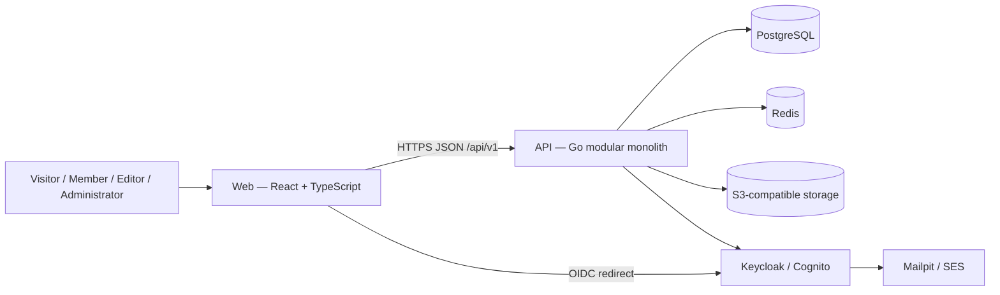

# Architecture — Containers

Status: **Planned.** No container in this document currently exists in the repository (Phase 0 in progress).

## Planned Containers

| Container | Technology | Responsibility |
|---|---|---|
| Web | React, TypeScript, Vite | Public and future administrative user interface |
| API | Go, `net/http`, `chi` | HTTP API, business rules, authorization |
| Database | PostgreSQL | System of record for species, articles, taxonomy, users |
| Cache / auxiliary store | Redis | Rate limiting, short-lived cache, idempotency (only when a concrete need exists) |
| Object storage | LocalStack (local) / S3 (AWS) | Media assets |
| Identity provider | Keycloak (local) / Cognito (AWS) | Authentication |
| Mail capture | Mailpit (local) / SES (AWS) | Outbound email |

## Container Diagram (Planned)

## API Module Boundaries (Planned)

The Go API is a **modular monolith**. Planned modules: `taxonomy`, `species`, `articles`, `media`, `users`, `authentication`, `administration`, `gamification`, `search`, `platform`. Each module may contain `domain/`, `application/`, `infrastructure/`, and `transport/` layers, created only when a layer has real responsibility. See [`CLAUDE.md`](../../CLAUDE.md) section 5 for the full architectural strategy and section 6 for the expected repository structure.

## Current State

`apps/api` exists as a minimal Go module (`github.com/VieiraGabrielAlexandre/reptile-collection/apps/api`) with only a `platform` layer so far:

* `cmd/api` — process entrypoint, config loading, graceful shutdown;
* `internal/platform/config` — typed, validated environment configuration;
* `internal/platform/httpserver` — chi router, panic recovery, correlation-ID middleware, structured request-logging middleware, server lifecycle;
* `internal/platform/health` — `GET /health` and `GET /ready` handlers.

No domain module (`taxonomy`, `species`, `articles`, etc.) exists yet — there is no business logic to justify one.

`apps/web` exists as a minimal Vite + React + TypeScript + Tailwind CSS shell:

* `src/main.tsx` — application entry, mounts `RouterProvider`;
* `src/app/router` — a single-route `createBrowserRouter` configuration (`/` only);
* `src/app/styles` — a minimal semantic design-token foundation (background, foreground, surface, border, accent, focus);
* `src/components/layout` — `PublicLayout` (skip link + `main` landmark), `Header`, `Footer`;
* `src/features/home/pages` — a temporary `HomePage` that explicitly states the catalog is not available yet.

Nothing in `apps/web` calls `apps/api` yet — there is no `TanStack Query`, `React Hook Form`, or `Zod` usage, since nothing is fetched or submitted yet. Those will be introduced with the first real API integration in Phase 1.
