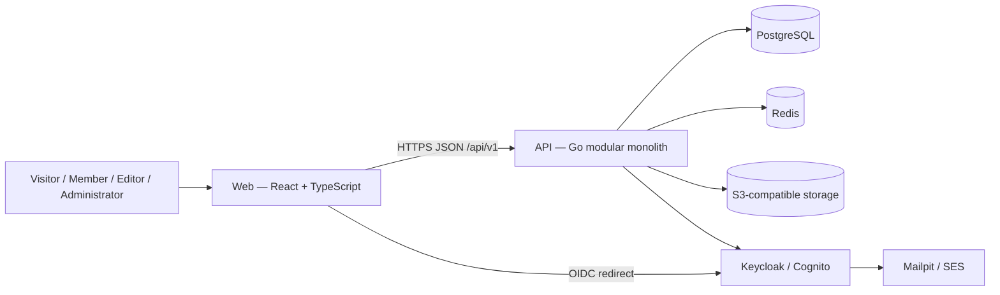

# Architecture — Containers

Status: **Planned.** No container in this document currently exists in the repository (Phase 0 in progress).

## Planned Containers

| Container | Technology | Responsibility |
|---|---|---|
| Web | React, TypeScript, Vite | Public and future administrative user interface |
| API | Go, `net/http`, `chi` | HTTP API, business rules, authorization |
| Database | PostgreSQL | System of record for species, articles, taxonomy, users |
| Cache / auxiliary store | Redis | Rate limiting, short-lived cache, idempotency (only when a concrete need exists) |
| Object storage | LocalStack (local) / S3 (AWS) | Media assets |
| Identity provider | Keycloak (local) / Cognito (AWS) | Authentication |
| Mail capture | Mailpit (local) / SES (AWS) | Outbound email |

## Container Diagram (Planned)

## API Module Boundaries (Planned)

The Go API is a **modular monolith**. Planned modules: `taxonomy`, `species`, `articles`, `media`, `users`, `authentication`, `administration`, `gamification`, `search`, `platform`. Each module may contain `domain/`, `application/`, `infrastructure/`, and `transport/` layers, created only when a layer has real responsibility. See [`CLAUDE.md`](../../CLAUDE.md) section 5 for the full architectural strategy and section 6 for the expected repository structure.

## Current State

No `apps/api` or `apps/web` directory exists yet. This document will be updated with an "as-built" section once Phase 0 backend and frontend foundations are implemented.
