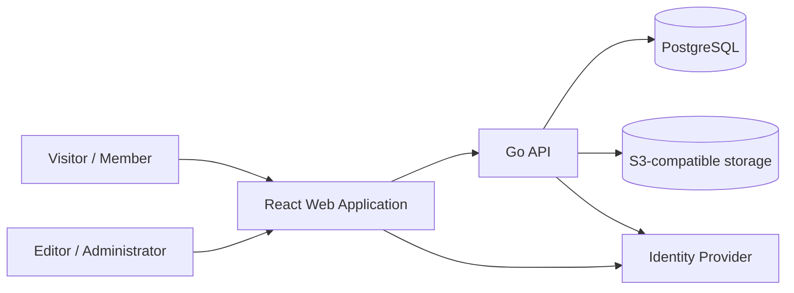

# Architecture — System Context

Status: **Planned.** No part of this system is implemented yet (Phase 0 in progress). This document describes the intended context, not current running software.

## Purpose

Reptile Collection is an editorial platform providing structured, trustworthy, scientifically grounded information about reptile species.

## Users

* **Visitor** — unauthenticated reader browsing published species and articles.
* **Member** — registered user with a profile (from Phase 2 onward).
* **Editor** — creates and updates draft content (from Phase 3 onward).
* **Administrator** — manages users, taxonomy, and publishing (from Phase 3 onward).

## External Systems

* **Keycloak** — identity provider (local environment); replaced by **Cognito** in the future AWS environment.
* **S3-compatible object storage** — media storage; **LocalStack** locally, real **S3** (with CloudFront) on AWS.
* **Mailpit** — local email capture; replaced by **SES** on AWS.

## System Context Diagram (Planned)

Locally, `Identity` is Keycloak and `Storage` is LocalStack-emulated S3. On future AWS environments, `Identity` is Cognito and `Storage` is real S3.

## Quality Attributes

* accessibility and security by default;
* reproducible local environment without real AWS credentials;
* evolutionary architecture — modular monolith, not microservices;
* observability from the beginning (structured logs, correlation IDs, health/readiness).

See [containers.md](containers.md) for the container-level view and [deployment.md](deployment.md) for current versus future deployment topology.
