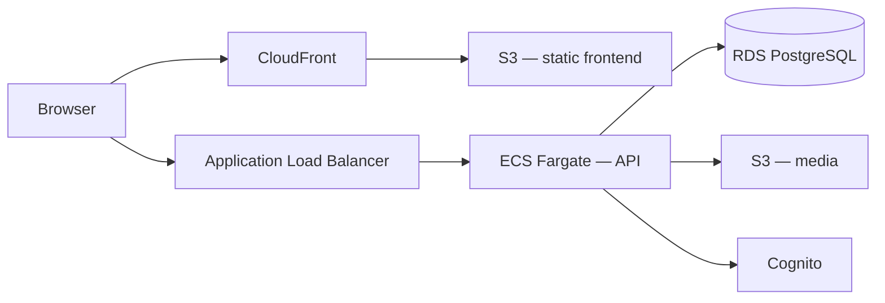

# Architecture — Deployment

This document distinguishes **current local deployment** (target for Phase 0) from **future AWS deployment** (Phase 6). Neither is implemented yet — both descriptions below are planned, not current, state.

## Current: Local Deployment (Planned for Phase 0)

Local deployment uses Docker Compose. No real AWS account or credentials are required.

Planned services and ports:

```text
Frontend:   http://localhost:3000
Backend:    http://localhost:8080
Health:     http://localhost:8080/health
Readiness:  http://localhost:8080/ready
Keycloak:   http://localhost:8081
Mailpit:    http://localhost:8025
LocalStack: http://localhost:4566
```

PostgreSQL and Redis run as Docker Compose services and are exposed to the host only as needed for local tooling. LocalStack emulates the S3 bucket used for media storage; RDS is never emulated locally — local PostgreSQL runs directly via Docker Compose. Terraform may manage the local S3 bucket (and, later, other LocalStack-supported resources) through a dedicated `local` environment that points at LocalStack endpoints with dummy credentials.

## Future: AWS Deployment (Planned for Phase 6)

The future target platform is AWS. Planned components, used only when appropriate:

* VPC with public and private subnets;
* ECS Fargate running the API (and a worker, if a concrete asynchronous workload exists);
* ECR for container images;
* Application Load Balancer with HTTPS (ACM) and optional WAF;
* RDS PostgreSQL (private subnet, encrypted, backed up);
* ElastiCache for Redis, only if a concrete cache/coordination need exists;
* S3 + CloudFront for media and the static frontend build;
* Cognito as the identity provider (replacing Keycloak);
* SES for outbound email (replacing Mailpit);
* SQS, only if a concrete asynchronous workflow exists;
* CloudWatch for logs, metrics, and alarms;
* Secrets Manager for credentials and sensitive configuration;
* Route 53 for DNS.

Terraform environments are isolated per environment (`local`, `development`, `staging`, `production`), each with its own state. `terraform apply` and `terraform destroy` are never run against a real AWS account without explicit authorization — see [ADR-0007](../adr/0007-use-terraform-environment-directories.md).

## Deployment Diagram (Future — Not Current)



This diagram represents a **planned future state only**. No AWS resource described here currently exists.

## Current State

No `compose.yaml`, `Dockerfile`, or `infrastructure/terraform/` directory exists yet. This document will gain a verified "as-built" local-deployment section once Phase 0 local-development work is implemented and validated.
